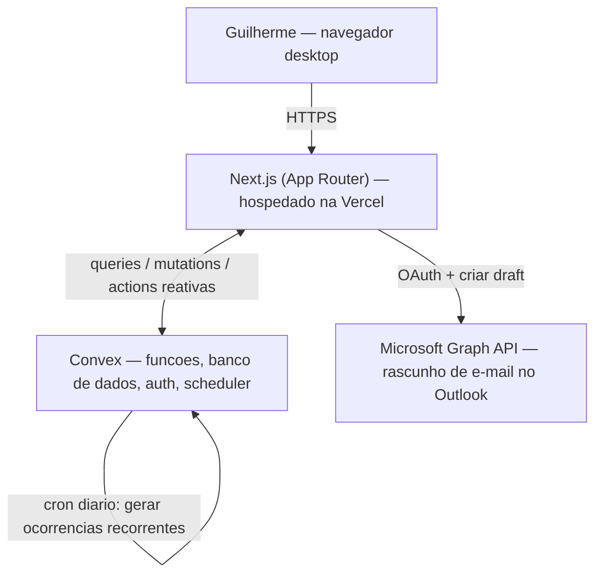

# PRD — Ascend

> Blueprint técnico do Ascend, gerado pelo PLAID. Este documento é consumido diretamente por um agente de código (Claude Code) para construir o app. A base estratégica está em `docs/product-vision.md`; o plano de build em `docs/product-roadmap.md`.
>
> Convenção: a prosa está em português; nomes de tabelas, campos, funções, rotas e pacotes estão em inglês, como devem aparecer no código.

## 1. Overview

### Product Summary

**Ascend** — "Ascend é um gerenciador de tarefas que transforma sua produtividade num RPG: cada tarefa concluída vira XP."

O Ascend é um gerenciador de tarefas web, de uso pessoal e single-user. Ele organiza tarefas em projetos, com prazos e recorrências, e prioriza o dia numa tela de entrada. Sobre essa base funcional, roda uma camada de gamificação de RPG: XP por tarefa concluída, bônus por metas diárias/semanais/mensais e níveis de 1 a 100 com curva de XP escalonada.

### Objective

Este PRD cobre o MVP definido em `docs/product-vision.md` § Definição do MVP: login de usuário único, CRUD de projetos e tarefas, motor de recorrência, tela de entrada (Hoje), sistema de gamificação completo, busca e filtros, tela de progresso e integração com Outlook (P1). Itens em `docs/product-vision.md` § Explicitamente Fora de Escopo não são cobertos.

### Market Differentiation

A implementação precisa entregar duas coisas ao mesmo tempo: uma gestão de tarefas tão limpa e rápida quanto a de um Todoist, e uma camada de gamificação que seja sentida sem estorvar. Na prática, isso significa que o XP e o nível são um HUD onipresente porém discreto, e que a criação e conclusão de tarefas nunca passam por uma tela de jogo. A camada de RPG é puro feedback visual sobre uma estrutura de dados; ela não adiciona telas de gerenciamento.

### Magic Moment

O momento mágico é o "Level Up" do fim do dia. Tecnicamente, isso exige: (1) `tasks.complete` retorna o XP ganho e o novo estado de progressão na mesma resposta; (2) a barra de XP é um componente reativo ligado a `userStats`, atualizando sem refresh; (3) quando uma conclusão cruza o limiar de nível, a UI dispara uma animação dedicada de "Level Up". A latência percebida entre clicar em "concluir" e ver o XP subir deve ser imperceptível (otimismo de UI — atualização local imediata, confirmação do servidor em seguida).

### Success Criteria

- Criar uma tarefa simples (projeto + título) leva menos de 10 segundos e menos de 4 cliques/campos.
- Concluir uma tarefa reflete o ganho de XP na tela em menos de 200 ms (com atualização otimista).
- O "Level Up" dispara de forma confiável e visível sempre que uma conclusão cruza o limiar de nível.
- A tela de entrada carrega e mostra as tarefas do dia em menos de 2 s.
- Todos os requisitos P0 funcionais e operantes; recorrência diária, semanal e mensal geram ocorrências corretas.

## 2. Technical Architecture

### Architecture Overview



O cliente Next.js conversa com o Convex para tudo que é dado e lógica. O Convex guarda o banco, roda as funções de negócio (incluindo a lógica de gamificação) e cuida do login. A integração com o Outlook é a única dependência externa: o cliente obtém um token Microsoft via OAuth e chama a Microsoft Graph API para criar um rascunho de e-mail. Um cron job no Convex cuida da manutenção diária da recorrência.

### Chosen Stack

| Layer | Choice | Rationale |
|---|---|---|
| Frontend | Next.js | Maior ecossistema React e melhor suporte das ferramentas de IA, o que faz o Claude Code construir com mais precisão e menos fricção. Integra muito bem com o Convex. |
| Backend | Convex | Backend-as-a-service reativo com zero boilerplate, ideal para construir com um agente de código. Já traz auth, storage, agendamento e busca embutidos, com plano gratuito generoso. |
| Database | Convex Database | Banco documento-relacional embutido no Convex: vem no pacote, sem configuração extra. Queries reativas atualizam a tela automaticamente e o schema é validado em TypeScript. |
| Auth | Convex Auth | Login nativo do Convex, com configuração zero. Suporta e-mail/senha, login social e magic link. Para um app de usuário único, é a opção mais simples e suficiente. |
| Payments | Nenhum | O Ascend é de uso pessoal, sem monetização. |

> Estas escolhas foram feitas pelo fundador no intake do PLAID. O agente de código deve implementá-las como estão, sem sugerir alternativas.

### Stack Integration Guide

**Ordem de setup:** (1) criar o projeto Next.js com TypeScript, App Router e Tailwind; (2) instalar e inicializar o Convex (`npx convex dev` cria o deployment e o diretório `convex/`); (3) instalar e configurar o Convex Auth (`@convex-dev/auth`) com o provedor de e-mail/senha; (4) só depois construir features.

**Padrões de integração:** o app é envolvido por um `ConvexAuthNextjsProvider` (cliente) e usa o middleware do Convex Auth para proteger rotas. Componentes leem dados com `useQuery` e escrevem com `useMutation`. Como as queries do Convex são reativas, a UI atualiza sozinha quando o dado muda — não há necessidade de gerenciamento manual de estado de servidor (sem React Query/SWR).

**Gotchas conhecidos:**
- Queries do Convex devem ser puras e determinísticas; chamadas a APIs externas (Microsoft Graph) só podem ocorrer em `actions`, nunca em `query` ou `mutation`.
- Datas: padronizar o fuso em America/Sao_Paulo. "Hoje", "vencido", chaves de período de meta e o reset de streak dependem de uma definição consistente de "dia". Guardar `dueDate` como timestamp (ms) e derivar a data local com `date-fns-tz`.
- A geração de ocorrências recorrentes roda num cron do Convex; ele deve ser idempotente (não duplicar a ocorrência se rodar duas vezes no mesmo dia).
- Atualização otimista em `tasks.complete`: usar o optimistic update do Convex para refletir o XP antes da confirmação do servidor.

**Variáveis de ambiente:**
- `NEXT_PUBLIC_CONVEX_URL` — URL do deployment Convex.
- `CONVEX_DEPLOYMENT` — identificador do deployment (gerado pelo CLI).
- `AUTH_SECRET` — segredo do Convex Auth.
- `MS_CLIENT_ID`, `MS_CLIENT_SECRET`, `MS_TENANT_ID`, `MS_REDIRECT_URI` — credenciais do app registrado no Azure para a integração com Outlook (apenas na fase da feature de Outlook).

### Repository Structure

```
ascend/
├── src/
│   ├── app/                       # Next.js App Router
│   │   ├── (auth)/login/page.tsx  # Tela de login
│   │   ├── (app)/today/page.tsx   # Tela de entrada (Hoje)
│   │   ├── (app)/projects/[id]/page.tsx  # Visao de um projeto
│   │   ├── (app)/search/page.tsx  # Busca e filtros
│   │   ├── (app)/profile/page.tsx # Progresso e estatisticas
│   │   ├── (app)/settings/page.tsx
│   │   ├── (app)/layout.tsx       # Layout autenticado: sidebar + HUD de XP
│   │   ├── layout.tsx             # Root layout + ConvexAuthNextjsProvider
│   │   └── globals.css
│   ├── components/
│   │   ├── ui/                    # Primitivos do design system (ver docs/design.md)
│   │   ├── tasks/                 # TaskRow, TaskForm, TaskDetail, etc.
│   │   ├── projects/              # ProjectList, ProjectForm
│   │   └── game/                  # XpBar, LevelBadge, LevelUpOverlay, GoalTracker
│   ├── lib/
│   │   ├── dates.ts               # Helpers de data/fuso (America/Sao_Paulo)
│   │   └── utils.ts
│   └── middleware.ts              # Protege rotas via Convex Auth
├── convex/
│   ├── schema.ts                  # Schema do banco
│   ├── auth.ts                    # Config do Convex Auth
│   ├── auth.config.ts
│   ├── gameConfig.ts              # CONSTANTES de gamificacao (XP, metas, curva)
│   ├── gamification.ts            # Logica de XP, niveis, metas, streak
│   ├── projects.ts                # Queries/mutations de projetos
│   ├── tasks.ts                   # Queries/mutations de tarefas
│   ├── recurrence.ts              # Motor de recorrencia + cron
│   ├── stats.ts                   # Queries de userStats
│   ├── outlook.ts                 # Action de integracao com Microsoft Graph
│   └── crons.ts                   # Definicao dos cron jobs
├── public/
├── .env.local
├── package.json
├── tailwind.config.ts
└── tsconfig.json
```

### Infrastructure & Deployment

**Frontend:** deploy na Vercel, conectado ao repositório do GitHub — cada push na branch principal publica automaticamente. **Backend/banco:** Convex Cloud; `npx convex deploy` promove as funções para produção (a Vercel pode rodar isso no build). **Variáveis de ambiente:** configuradas no painel da Vercel (as `NEXT_PUBLIC_*` e as `MS_*`) e no painel do Convex (segredos de servidor). Recomenda-se um deployment Convex de desenvolvimento e um de produção.

### Security Considerations

- **Autenticação:** Convex Auth com e-mail/senha. Como é single-user, não há fluxo de convite ou de papéis.
- **Autorização:** toda query e mutation valida `ctx.auth` e filtra por `userId`. Nenhuma função retorna dados sem dono. Mesmo sendo um app de um usuário, esse filtro é obrigatório para não vazar dados caso a URL seja acessada por terceiros.
- **Proteção de rotas:** o `middleware.ts` redireciona usuários não autenticados para `/login`.
- **Validação de entrada:** toda mutation valida os argumentos com os validadores do Convex (`v.string()`, etc.); os formulários no cliente usam `zod` + `react-hook-form`.
- **Outlook:** o token OAuth da Microsoft é de curta duração e nunca é persistido em texto puro; a chamada à Graph API ocorre numa `action` do Convex ou no cliente, com escopo mínimo (`Mail.ReadWrite`).
- **Segredos:** `MS_CLIENT_SECRET` e `AUTH_SECRET` ficam apenas no ambiente de servidor, nunca em variáveis `NEXT_PUBLIC_*`.

### Cost Estimate

Para um único usuário, o custo esperado nos primeiros 6 meses é de **R$ 0 / mês**:

- **Convex:** plano gratuito (Starter) — cobre com folga o volume de um usuário (funções, banco, auth).
- **Vercel:** plano Hobby gratuito — suficiente para um app pessoal.
- **Microsoft Graph / Azure AD:** registro de app gratuito; a Graph API não cobra pelo uso de e-mail nesse volume.
- **Domínio (opcional):** ~R$ 40-60/ano se Guilherme quiser um domínio próprio em vez do subdomínio `.vercel.app`.

## 3. Data Model

Banco do Convex (`convex/schema.ts`). Todos os timestamps são `number` (Unix ms). Datas de calendário (para "hoje", metas e streak) são `string` no formato `YYYY-MM-DD`, fuso America/Sao_Paulo.

### Entity Definitions

```typescript
// convex/schema.ts
import { defineSchema, defineTable } from "convex/server";
import { v } from "convex/values";

export default defineSchema({
  // ...tabelas do Convex Auth (users, etc.) sao incluidas pelo authTables

  // Estado de progressao do usuario — uma linha por usuario
  userStats: defineTable({
    userId: v.id("users"),
    totalXp: v.number(),            // XP acumulado total, nunca diminui
    level: v.number(),              // 1 a 100
    xpIntoLevel: v.number(),        // XP acumulado dentro do nivel atual
    currentStreak: v.number(),      // dias consecutivos com meta diaria batida
    longestStreak: v.number(),
    lastGoalMetDate: v.optional(v.string()), // "YYYY-MM-DD" do ultimo dia com meta batida
  }).index("by_user", ["userId"]),

  // Projetos que agrupam tarefas
  projects: defineTable({
    userId: v.id("users"),
    name: v.string(),               // obrigatorio
    color: v.string(),              // token de cor de docs/design.md; default definido na criacao
    isArchived: v.boolean(),        // default false
    sortOrder: v.number(),          // ordem de exibicao
  }).index("by_user", ["userId"]),

  // Tarefas (avulsas e recorrentes)
  tasks: defineTable({
    userId: v.id("users"),
    projectId: v.id("projects"),    // obrigatorio — toda tarefa pertence a um projeto
    title: v.string(),              // obrigatorio
    description: v.optional(v.string()),
    dueDate: v.optional(v.string()),       // "YYYY-MM-DD" — so para tarefas avulsas
    recurrence: v.optional(v.object({      // se presente, a tarefa e recorrente
      type: v.union(v.literal("daily"), v.literal("weekly"), v.literal("monthly")),
      weekdays: v.optional(v.array(v.number())), // 0-6 (dom-sab), para type "weekly"
      monthDay: v.optional(v.number()),          // 1-31, para type "monthly"
    })),
    isCompleted: v.boolean(),        // so para tarefas avulsas (recorrentes usam taskCompletions)
    completedAt: v.optional(v.number()),
    isDeleted: v.boolean(),          // soft delete; default false
  })
    .index("by_user", ["userId"])
    .index("by_project", ["projectId"])
    .searchIndex("search_title", { searchField: "title", filterFields: ["userId"] }),

  // Eventos de conclusao — uma linha por conclusao (inclui cada ocorrencia recorrente)
  taskCompletions: defineTable({
    userId: v.id("users"),
    taskId: v.id("tasks"),
    completionDate: v.string(),      // "YYYY-MM-DD" da ocorrencia concluida
    xpAwarded: v.number(),
    completedAt: v.number(),
  })
    .index("by_user_date", ["userId", "completionDate"])
    .index("by_task_date", ["taskId", "completionDate"]),

  // Bonus de meta ja concedidos — evita conceder XP em dobro
  goalAwards: defineTable({
    userId: v.id("users"),
    goalType: v.union(v.literal("daily"), v.literal("weekly"), v.literal("monthly")),
    periodKey: v.string(),           // "2026-05-21" (dia), "2026-W21" (semana), "2026-05" (mes)
    xpAwarded: v.number(),
    awardedAt: v.number(),
  }).index("by_user_type_period", ["userId", "goalType", "periodKey"]),
});
```

### Relationships

- **users 1:1 userStats** — cada usuário tem exatamente uma linha de progressão, criada no primeiro login.
- **users 1:many projects** — ligados por `projects.userId`.
- **projects 1:many tasks** — ligados por `tasks.projectId`. Ao arquivar um projeto, suas tarefas somem da tela Hoje; ao excluir um projeto, suas tarefas recebem soft delete (`isDeleted = true`).
- **tasks 1:many taskCompletions** — uma tarefa avulsa tem no máximo uma conclusão; uma tarefa recorrente tem uma conclusão por ocorrência concluída.
- **users 1:many goalAwards** — histórico de bônus de meta, único por (`goalType`, `periodKey`).

### Indexes

- `userStats.by_user` — buscar a progressão do usuário logado (consulta constante, em toda tela).
- `projects.by_user` — listar projetos do usuário na sidebar.
- `tasks.by_user` — base para a tela Hoje e para filtros gerais.
- `tasks.by_project` — listar tarefas de um projeto.
- `tasks.search_title` — índice de busca full-text por título, filtrado por `userId`.
- `taskCompletions.by_user_date` — contar conclusões do dia/semana/mês para avaliar metas e streak.
- `taskCompletions.by_task_date` — verificar se uma ocorrência recorrente já foi concluída numa data.
- `goalAwards.by_user_type_period` — checar se um bônus de meta já foi concedido naquele período.

## 4. API Specification

### API Design Philosophy

O backend é o Convex: não há REST. A lógica é exposta como **queries** (leitura reativa), **mutations** (escrita transacional) e **actions** (efeitos colaterais externos, ex.: Microsoft Graph). Toda função autentica via `ctx.auth.getUserId()` e rejeita chamadas anônimas. Erros são lançados como exceções com mensagem legível; o cliente as captura e exibe via toast. Não há paginação no MVP (o volume de um usuário é pequeno); a busca usa o search index do Convex.

### Endpoints

```typescript
// convex/projects.ts
query("projects.list", {
  args: { includeArchived: v.optional(v.boolean()) },
  returns: v.array(/* project */),
})
mutation("projects.create", { args: { name: v.string(), color: v.optional(v.string()) }, returns: v.id("projects") })
mutation("projects.rename", { args: { projectId: v.id("projects"), name: v.string() } })
mutation("projects.setColor", { args: { projectId: v.id("projects"), color: v.string() } })
mutation("projects.archive", { args: { projectId: v.id("projects"), isArchived: v.boolean() } })
mutation("projects.remove", { args: { projectId: v.id("projects") } }) // soft delete do projeto + tarefas

// convex/tasks.ts
query("tasks.listToday", {           // tarefas avulsas vencidas/de hoje + ocorrencias recorrentes de hoje
  args: {},
  returns: v.array(/* task com flag isOverdue, isToday */),
})
query("tasks.listByProject", { args: { projectId: v.id("projects") }, returns: v.array(/* task */) })
query("tasks.search", {              // busca por texto em titulo/descricao + filtro de projeto
  args: { text: v.optional(v.string()), projectId: v.optional(v.id("projects")) },
  returns: v.array(/* task */),
})
query("tasks.get", { args: { taskId: v.id("tasks") }, returns: v.union(/* task */, v.null()) })
mutation("tasks.create", {
  args: {
    projectId: v.id("projects"),
    title: v.string(),
    description: v.optional(v.string()),
    dueDate: v.optional(v.string()),
    recurrence: v.optional(/* recurrence object */),
  },
  returns: v.id("tasks"),
})
mutation("tasks.update", { args: { taskId: v.id("tasks"), /* campos editaveis */ } })
mutation("tasks.complete", {         // CONCLUI a tarefa/ocorrencia e dispara a gamificacao
  args: { taskId: v.id("tasks"), occurrenceDate: v.optional(v.string()) },
  returns: v.object({
    xpAwarded: v.number(),
    goalBonuses: v.array(v.object({ goalType: v.string(), xp: v.number() })),
    leveledUp: v.boolean(),
    newLevel: v.number(),
    totalXp: v.number(),
  }),
})
mutation("tasks.uncomplete", { args: { taskId: v.id("tasks"), occurrenceDate: v.optional(v.string()) } })
mutation("tasks.remove", { args: { taskId: v.id("tasks") } }) // soft delete

// convex/stats.ts
query("stats.get", { args: {}, returns: /* userStats + progresso para o proximo nivel + estado das metas do dia/semana/mes */ })

// convex/outlook.ts
action("outlook.createDraft", {      // P1 — cria um rascunho de e-mail no Outlook a partir de uma tarefa
  args: { taskId: v.id("tasks") },
  returns: v.object({ draftWebLink: v.string() }),
})

// convex/recurrence.ts — interno, chamado pelo cron
internalMutation("recurrence.ensureTodayOccurrences", { args: {} })
```

**Regra-chave de `tasks.complete`:** é uma única mutation transacional que (1) registra a conclusão em `taskCompletions` (e marca `isCompleted` se for avulsa), (2) concede o XP da tarefa, (3) reavalia metas diária/semanal/mensal e concede bônus ainda não concedidos, (4) recalcula nível e streak, (5) retorna tudo o que a UI precisa para animar o ganho de XP e o "Level Up". `tasks.uncomplete` reverte a conclusão e o XP da tarefa; bônus de meta concedidos não são revertidos (decisão de simplicidade — ver § 14).

## 5. User Stories

### Epic: Projetos

**US-001: Criar projeto**
Como Guilherme, quero criar um projeto para agrupar tarefas de uma frente de trabalho ou área da vida.
Acceptance Criteria:
- [ ] Dado que estou logado, quando crio um projeto com um nome, então ele aparece na sidebar.
- [ ] Edge case: nome vazio → o botão de salvar fica desabilitado.

**US-002: Renomear, recolorir e arquivar projeto**
Como Guilherme, quero editar e arquivar projetos para manter a organização viva.
Acceptance Criteria:
- [ ] Quando renomeio um projeto, o novo nome reflete em todas as telas.
- [ ] Quando arquivo um projeto, suas tarefas somem da tela Hoje, mas não são apagadas.
- [ ] Edge case: excluir um projeto pede confirmação e aplica soft delete nele e nas tarefas.

### Epic: Tarefas

**US-003: Criar tarefa avulsa**
Como Guilherme, quero criar uma tarefa com projeto, título e, opcionalmente, descrição e prazo.
Acceptance Criteria:
- [ ] Dado um projeto existente, quando informo projeto e título, então a tarefa é criada.
- [ ] Quando defino um prazo, a tarefa aparece na tela Hoje na data certa.
- [ ] Edge case: sem projeto selecionado → salvar fica desabilitado.

**US-004: Criar tarefa recorrente**
Como Guilherme, quero definir recorrência (ex.: toda terça) para uma tarefa repetida não ser recadastrada.
Acceptance Criteria:
- [ ] Quando defino recorrência semanal nas terças, então a ocorrência aparece na tela Hoje toda terça.
- [ ] Quando concluo a ocorrência de hoje, a próxima ocorrência futura permanece programada.
- [ ] Edge case: recorrência mensal no dia 31 em meses com 30 dias → a ocorrência cai no último dia do mês.

**US-005: Concluir tarefa e ganhar XP**
Como Guilherme, quero concluir uma tarefa e ver o XP ganho na hora.
Acceptance Criteria:
- [ ] Quando concluo uma tarefa, então a barra de XP sobe imediatamente e o valor ganho é exibido.
- [ ] Quando uma conclusão cruza o limiar de nível, então a animação de "Level Up" dispara.
- [ ] Edge case: desfazer a conclusão remove o XP daquela tarefa.

**US-006: Editar e excluir tarefa**
Como Guilherme, quero editar os dados de uma tarefa ou removê-la.
Acceptance Criteria:
- [ ] Quando edito título, descrição, prazo ou recorrência, as mudanças são salvas.
- [ ] Quando excluo uma tarefa, ela some das listas (soft delete).

### Epic: Tela de Entrada e Busca

**US-007: Ver o dia priorizado**
Como Guilherme, quero abrir o app e ver minhas tarefas priorizadas por data, com hoje em destaque.
Acceptance Criteria:
- [ ] Quando abro a tela Hoje, vejo as tarefas de hoje destacadas e as vencidas sinalizadas.
- [ ] As tarefas aparecem ordenadas por data de entrega.
- [ ] Edge case: nenhuma tarefa para hoje → estado vazio com a mensagem de voz da marca.

**US-008: Buscar e filtrar tarefas**
Como Guilherme, quero encontrar uma tarefa por texto ou por projeto.
Acceptance Criteria:
- [ ] Quando digito um termo, vejo tarefas cujo título ou descrição contêm o termo.
- [ ] Quando filtro por projeto, vejo apenas tarefas daquele projeto.

### Epic: Progressão

**US-009: Acompanhar nível e metas**
Como Guilherme, quero ver meu nível, XP e o estado das metas para sentir o progresso.
Acceptance Criteria:
- [ ] A tela de perfil mostra nível atual, XP total e progresso para o próximo nível.
- [ ] As metas diária, semanal e mensal mostram progresso atual e alvo.
- [ ] A sequência (streak) de dias com meta batida é exibida.

### Epic: Integração Outlook (P1)

**US-010: Rascunhar e-mail a partir de uma tarefa**
Como Guilherme, quero rascunhar um e-mail no Outlook ligado a uma tarefa, sem trocar de ferramenta.
Acceptance Criteria:
- [ ] Quando clico em "rascunhar e-mail" numa tarefa, um rascunho é criado no Outlook com assunto e corpo pré-preenchidos a partir da tarefa.
- [ ] Edge case: token Microsoft expirado → o app pede reautenticação; se a integração falhar, oferece um fallback `mailto:`.

## 6. Functional Requirements

**FR-001: Login de usuário único**
Priority: P0
Description: Autenticação por e-mail/senha via Convex Auth. Rotas do app protegidas por middleware; usuário não autenticado vai para `/login`. No primeiro login, criar a linha de `userStats` (nível 1, 0 XP).
Acceptance Criteria: login e logout funcionam; rotas protegidas; `userStats` criado uma única vez.
Related Stories: US-001

**FR-002: CRUD de projetos**
Priority: P0
Description: Criar, renomear, recolorir, arquivar e excluir (soft delete) projetos. Todo projeto pertence ao usuário logado.
Acceptance Criteria: as quatro operações funcionam; projeto arquivado não aparece na tela Hoje; exclusão pede confirmação.
Related Stories: US-001, US-002

**FR-003: CRUD de tarefas avulsas**
Priority: P0
Description: Criar tarefa com `projectId`, `title`, `description?` e `dueDate?`; editar; excluir (soft delete). Validação no cliente (`zod`) e no servidor.
Acceptance Criteria: ciclo completo da tarefa funciona; campos obrigatórios validados.
Related Stories: US-003, US-006

**FR-004: Motor de recorrência**
Priority: P0
Description: Tarefas com `recurrence` (diária; semanal por dias da semana; mensal por data). Uma `internalMutation` (`recurrence.ensureTodayOccurrences`) roda num cron diário e garante que as ocorrências do dia existam/estejam disponíveis. A geração é idempotente. Recorrência mensal em dia inexistente cai no último dia do mês.
Acceptance Criteria: ocorrências geradas nos dias certos; sem duplicação; conclusão de uma ocorrência não afeta as futuras.
Related Stories: US-004

**FR-005: Tela de entrada (Hoje)**
Priority: P0
Description: `tasks.listToday` retorna tarefas avulsas de hoje e vencidas, mais as ocorrências recorrentes de hoje, ordenadas por data. A UI destaca hoje e sinaliza vencidas.
Acceptance Criteria: a tela responde "o que faço hoje?" corretamente; vencidas visíveis e sinalizadas.
Related Stories: US-007

**FR-006: XP por tarefa concluída**
Priority: P0
Description: Concluir uma tarefa concede `XP_PER_TASK` (config). Registra em `taskCompletions`. Desfazer remove o XP daquela tarefa.
Acceptance Criteria: XP creditado e exibido na conclusão; desfazer reverte.
Related Stories: US-005

**FR-007: Sistema de níveis 1-100**
Priority: P0
Description: O nível deriva do `totalXp` pela curva escalonada em `gameConfig.ts` (ver § 14 para a fórmula inicial). Concluir uma tarefa pode subir o nível; nível nunca regride. Cruzar um limiar de nível marca `leveledUp = true` no retorno.
Acceptance Criteria: nível calculado corretamente; "Level Up" sinalizado quando cruzado.
Related Stories: US-005, US-009

**FR-008: Bônus de metas diária, semanal e mensal**
Priority: P0
Description: Ao concluir uma tarefa, reavaliar as metas: diária (≥ alvo de tarefas no dia), semanal (≥ alvo na semana), mensal (≥ alvo no mês). Conceder o bônus de XP correspondente uma única vez por período, registrando em `goalAwards`.
Acceptance Criteria: bônus concedido ao atingir cada meta; nunca concedido em dobro no mesmo período.
Related Stories: US-009

**FR-009: Sequência (streak) de dias**
Priority: P0
Description: A cada dia em que a meta diária é batida, incrementar `currentStreak`; se um dia sem meta batida passar, zerar. Atualizar `longestStreak`. A definição de "dia" usa o fuso America/Sao_Paulo.
Acceptance Criteria: streak incrementa em dias consecutivos com meta; zera ao pular um dia.
Related Stories: US-009

**FR-010: HUD de XP e nível**
Priority: P0
Description: Uma barra de XP e o nível atual visíveis em todas as telas autenticadas, ligados reativamente a `userStats`/`stats.get`.
Acceptance Criteria: HUD presente em todas as telas; atualiza sem refresh.
Related Stories: US-005, US-009

**FR-011: Busca e filtros**
Priority: P0
Description: Busca full-text por título (search index do Convex) e por descrição; filtro por projeto. Resultados restritos ao usuário.
Acceptance Criteria: qualquer tarefa é localizável por título, descrição ou projeto.
Related Stories: US-008

**FR-012: Tela de progresso/perfil**
Priority: P1
Description: Tela dedicada com nível, XP total, progresso para o próximo nível, estado das três metas e a sequência atual/recorde.
Acceptance Criteria: todos os dados de progressão exibidos e corretos.
Related Stories: US-009

**FR-013: Animação de "Level Up"**
Priority: P1
Description: Quando `tasks.complete` retorna `leveledUp = true`, exibir um overlay/animação dedicado de subida de nível, com a mensagem na voz da marca.
Acceptance Criteria: a animação dispara de forma confiável ao subir de nível.
Related Stories: US-005

**FR-014: Integração com Outlook**
Priority: P1
Description: A partir de uma tarefa, criar um rascunho de e-mail no Outlook via Microsoft Graph API, com assunto = título da tarefa e corpo = descrição. Requer OAuth Microsoft. Fallback `mailto:` se a integração completa falhar.
Acceptance Criteria: rascunho criado no Outlook com contexto pré-preenchido; fallback funciona.
Related Stories: US-010

**FR-015: Estados visuais de tarefa**
Priority: P1
Description: Tarefa vencida sinalizada visualmente; tarefa concluída com tratamento visual distinto; ocorrência recorrente identificável.
Acceptance Criteria: os três estados são visualmente distintos.
Related Stories: US-007

**FR-016: Configuração de gamificação (via arquivo)**
Priority: P0
Description: Todas as constantes de gamificação (XP por tarefa, alvos e bônus de metas, curva de níveis) centralizadas em `convex/gameConfig.ts`, recalibráveis sem caçar valores pelo código.
Acceptance Criteria: alterar uma constante muda o comportamento sem outras edições.
Related Stories: —

## 7. Non-Functional Requirements

### Performance
- Tela Hoje com dados visíveis em < 2 s (LCP) em conexão de desktop comum.
- Resposta percebida de `tasks.complete` < 200 ms via atualização otimista.
- Bundle JS inicial < 250 KB (gzip).

### Security
- OWASP Top 10 endereçado no escopo de um app single-user.
- Toda query/mutation valida autenticação e filtra por `userId`.
- Segredos apenas em variáveis de servidor; nada sensível em `NEXT_PUBLIC_*`.
- Token OAuth da Microsoft com escopo mínimo (`Mail.ReadWrite`) e não persistido em texto puro.

### Accessibility
- Conformidade WCAG 2.1 AA nos fluxos principais.
- Navegável por teclado: criar tarefa, concluir tarefa e busca operáveis sem mouse.
- Contraste mínimo AA (definido em `docs/design.md`).

### Scalability
- O alvo é um único usuário; o plano gratuito do Convex e da Vercel cobre o uso com larga folga. Não há requisito de escala multiusuário no MVP.

### Reliability
- Disponibilidade herdada do Convex Cloud e da Vercel (sem SLA próprio).
- Degradação graciosa: falha de rede mostra erro claro e permite repetir; falha da integração Outlook cai no fallback `mailto:`.
- O cron de recorrência é idempotente — rodar de novo não duplica ocorrências.

## 8. UI/UX Requirements

> Tokens visuais (cores, tipografia, espaçamento, aparência dos componentes) ainda não definidos. Rode `/plaid design` para gerar `docs/design.md` antes de iniciar o trabalho de estilização. Esta seção cobre estrutura e comportamento; nomes de componentes referenciam `docs/design.md`.

### Screen: Login
Route: `/login`
Purpose: autenticar Guilherme.
Layout: tela central única, com o headline da marca ("Sua produtividade, com a progressão de um RPG") e o formulário de e-mail/senha.
States:
- Empty: formulário vazio.
- Loading: botão em estado de carregando durante a autenticação.
- Error: mensagem inline na voz da marca em caso de credencial inválida.
Key Interactions: enviar credenciais → autenticar → redirecionar para `/today`.
Components Used: `card`, `input-text`, `button-primary`.

### Screen: Hoje
Route: `/today`
Purpose: responder "o que faço hoje?".
Layout: layout autenticado padrão — sidebar de projetos à esquerda, HUD de XP/nível no topo, conteúdo principal com a lista do dia.
States:
- Empty: estado vazio com mensagem na voz da marca ("Lista de hoje limpa. Ou você é uma máquina, ou esqueceu de cadastrar tarefas.").
- Loading: skeleton das linhas de tarefa.
- Populated: tarefas ordenadas por data — vencidas no topo sinalizadas, hoje em destaque.
- Error: estado de erro com botão de repetir.
Key Interactions: concluir tarefa (checkbox → XP anima → possível "Level Up"); abrir tarefa (clique → detalhe); criar tarefa (botão → formulário).
Components Used: `sidebar`, `xp-bar`, `level-badge`, `task-row`, `button-primary`, `empty-state`.

### Screen: Projeto
Route: `/projects/[id]`
Purpose: ver e gerenciar as tarefas de um projeto.
Layout: igual ao Hoje; conteúdo principal lista as tarefas do projeto.
States: Empty (projeto sem tarefas), Loading, Populated, Error.
Key Interactions: criar tarefa já com o projeto pré-selecionado; renomear/recolorir/arquivar o projeto pelo cabeçalho.
Components Used: `sidebar`, `task-row`, `project-header`, `button-primary`.

### Screen: Busca
Route: `/search`
Purpose: reencontrar tarefas.
Layout: campo de busca no topo, filtro de projeto, lista de resultados.
States: Empty (nenhum termo → dica de uso), Loading, Populated (resultados), No Results (nenhuma tarefa encontrada).
Key Interactions: digitar termo → resultados ao vivo; selecionar projeto no filtro.
Components Used: `input-search`, `select`, `task-row`, `empty-state`.

### Screen: Perfil / Progresso
Route: `/profile`
Purpose: ver a progressão consolidada.
Layout: cartão de nível (nível, XP total, barra de progresso para o próximo nível), cartões das três metas, cartão da sequência.
States: Loading, Populated.
Key Interactions: leitura; sem ações de escrita.
Components Used: `level-badge`, `xp-bar`, `goal-card`, `stat-card`.

### Screen: Configurações
Route: `/settings`
Purpose: conta e logout.
Layout: lista simples de opções.
States: Populated.
Key Interactions: logout; (P1) conectar conta Microsoft para a integração Outlook.
Components Used: `button-secondary`, `card`.

### Modal/Dialog: Formulário de Tarefa
Purpose: criar/editar tarefa.
Layout: dialog com campos — projeto (select), título (texto), descrição (textarea opcional), prazo (date picker opcional), recorrência (controle opcional: tipo + dias da semana ou dia do mês).
States: criação (campos vazios), edição (campos preenchidos), salvando, erro de validação inline.
Key Interactions: salvar (desabilitado sem projeto+título); ao definir recorrência, o campo de prazo é substituído pela regra de recorrência.
Components Used: `dialog`, `select`, `input-text`, `textarea`, `date-picker`, `button-primary`.

### Overlay: Level Up
Purpose: marcar a subida de nível (o momento mágico).
Layout: overlay breve sobre a tela atual, com o novo nível em destaque e a mensagem na voz da marca.
States: dispara quando `tasks.complete` retorna `leveledUp = true`; dispensável por clique e some sozinho após alguns segundos.
Components Used: `level-up-overlay`, `level-badge`.

## 9. Auth Implementation

### Auth Flow
Convex Auth com provedor de e-mail/senha. Guilherme cria a conta uma vez; nas visitas seguintes, faz login. A sessão é mantida pelo Convex Auth (cookies gerenciados pelo helper de Next.js).

### Provider Configuration
- Instalar `@convex-dev/auth` e rodar o inicializador, que cria `convex/auth.ts` e `convex/auth.config.ts`.
- Configurar o provedor `Password` do Convex Auth.
- Definir `AUTH_SECRET` no ambiente do Convex.
- Envolver a aplicação com `ConvexAuthNextjsServerProvider` (server) e `ConvexAuthNextjsProvider` (client) no `src/app/layout.tsx`.

### Protected Routes
`src/middleware.ts` usa o helper `convexAuthNextjsMiddleware` para proteger o grupo de rotas `(app)`. Visitante não autenticado é redirecionado para `/login`. As rotas do grupo `(auth)` são públicas.

### User Session Management
No servidor, `convexAuthNextjsToken()` lê o token; no cliente, hooks do Convex Auth (`useAuthActions`, estado de autenticação) controlam login/logout. As funções do Convex obtêm o usuário com `ctx.auth.getUserId()`.

### Role-Based Access
Não se aplica — app de usuário único, sem papéis. Toda função apenas confirma que há um usuário autenticado e filtra os dados por `userId`.

## 10. Payment Integration

Não se aplica. O Ascend é de uso pessoal, sem monetização. Nenhuma integração de pagamento deve ser construída. Se algum dia houver intenção de monetizar, esta seção deverá ser revista.

## 11. Edge Cases & Error Handling

### Feature: Tarefas e Recorrência
| Scenario | Expected Behavior | Priority |
|---|---|---|
| Recorrência mensal no dia 31 em mês de 30 dias | A ocorrência cai no último dia do mês | P0 |
| Concluir a mesma ocorrência recorrente duas vezes | A segunda conclusão é ignorada (índice `by_task_date` evita duplicar) | P0 |
| Cron de recorrência roda duas vezes no dia | Geração idempotente — nenhuma ocorrência duplicada | P0 |
| Excluir um projeto com tarefas | Confirmação; soft delete do projeto e das tarefas | P0 |
| Tarefa avulsa com prazo no passado | Aparece na tela Hoje sinalizada como vencida | P0 |
| Editar a recorrência de uma tarefa | Vale da edição em diante; ocorrências passadas concluídas permanecem | P1 |

### Feature: Gamificação
| Scenario | Expected Behavior | Priority |
|---|---|---|
| Desfazer uma conclusão | Remove o XP daquela tarefa; bônus de meta já concedidos não são revertidos (ver § 14) | P0 |
| Conclusão cruza dois níveis de uma vez | O nível pula para o nível correto; "Level Up" mostra o nível final | P1 |
| Meta diária batida, depois uma tarefa é desfeita abaixo do alvo | O bônus diário não é estornado; não é reconcedido ao rebater a meta | P1 |
| Atingir o nível 100 | Para de subir de nível; o XP continua acumulando em `totalXp` | P2 |
| Virada de dia com o app aberto | A próxima conclusão recalcula com a data nova; streak avaliado no fuso correto | P0 |

### Feature: Rede e Autenticação
| Scenario | Expected Behavior | Priority |
|---|---|---|
| Falha de rede ao salvar | Toast de erro; a ação pode ser repetida; sem perda de dados | P0 |
| Sessão expira no meio do uso | Redireciona para `/login`; após reautenticar, volta ao app | P0 |
| Conclusão otimista que falha no servidor | A UI reverte o ganho de XP e mostra erro | P0 |

### Feature: Integração Outlook
| Scenario | Expected Behavior | Priority |
|---|---|---|
| Token Microsoft expirado | Pede reautenticação Microsoft | P1 |
| Microsoft Graph indisponível | Fallback: abrir um link `mailto:` pré-preenchido | P1 |
| Conta Microsoft nunca conectada | O botão de e-mail leva primeiro ao fluxo de conexão | P1 |

## 12. Dependencies & Integrations

### Core Dependencies
```json
{
  "next": "...",
  "react": "...",
  "react-dom": "...",
  "convex": "...",
  "@convex-dev/auth": "...",
  "tailwindcss": "...",
  "react-hook-form": "...",
  "zod": "...",
  "date-fns": "...",
  "date-fns-tz": "...",
  "lucide-react": "...",
  "@microsoft/microsoft-graph-client": "..."
}
```

### Development Dependencies
```json
{
  "typescript": "^5.x.x",
  "eslint": "^9.x.x",
  "eslint-config-next": "...",
  "prettier": "...",
  "@types/react": "...",
  "@types/node": "..."
}
```
Não fixar versões — o agente de código instala as últimas compatíveis no build.

### Third-Party Services
- **Convex Cloud** — backend, banco, auth, cron. Plano gratuito. Requer login no Convex e um deployment.
- **Vercel** — hospedagem do frontend. Plano Hobby gratuito.
- **Microsoft Graph API (Azure AD)** — criação de rascunho de e-mail no Outlook. Requer registro de um app no Azure (gratuito), `client id`/`secret` e o escopo `Mail.ReadWrite`. Usado apenas pela feature de Outlook (P1).

## 13. Out of Scope

Lista de `docs/product-vision.md` § Explicitamente Fora de Escopo. Não construir nenhum destes no MVP:

- **App mobile/nativo** — uso é majoritariamente desktop; reconsiderar após 2-3 meses se a captura fora do desktop virar dor.
- **Multiusuário, contas separadas, compartilhamento** — mudaria a arquitetura inteira; reconsiderar só se o app provar valor por meses.
- **Subtarefas / tarefas aninhadas** — projeto + tarefa cobre o essencial; reconsiderar diante de dor concreta.
- **Notificações e lembretes (push, e-mail)** — a tela Hoje já é o lembrete; reconsiderar se o esquecimento persistir.
- **Visão de calendário e sincronização de agenda** — a lista por data resolve o essencial; reconsiderar pós-MVP.
- **Conquistas, avatares, equipamentos, cosméticos** — é a complexidade que dispersa o Habitica; nível e XP bastam no MVP.
- **Tags/etiquetas além de projetos** — reconsiderar se a busca por projeto se mostrar insuficiente.
- **Relatórios e dashboards de produtividade** — a tela de progresso já dá o sinal essencial.

## 14. Open Questions

**Q1 — Fórmula da curva de XP.** Proposta inicial: `xpToNextLevel(level) = 100 + 50 * level` (nível 1→2 custa 150 XP; 2→3 custa 200; etc.). Tradeoffs: linear é previsível e fácil de calibrar; uma curva quadrática daria mais "peso" ao endgame. Recomendação: começar com a linear, definida em `gameConfig.ts`, e recalibrar após 2-4 semanas de uso real.

**Q2 — Alvos das metas.** Proposta inicial: meta diária = 5 tarefas concluídas (+50 XP); semanal = 25 tarefas na semana (+200 XP); mensal = 80 tarefas no mês (+500 XP). Tradeoff: alvos baixos demais banalizam o bônus, altos demais frustram. Recomendação: usar esses valores como ponto de partida e ajustá-los conforme o volume real de tarefas do Guilherme.

**Q3 — XP fixo ou ponderado por tarefa.** Proposta inicial: XP fixo de 10 por tarefa. Risco: incentivar tarefas-lixo para farmar XP. Recomendação: começar fixo; se o comportamento distorcer, introduzir um peso por prioridade/esforço (decisão pós-MVP).

**Q4 — Tolerância de sequência ("streak freeze").** Hoje a sequência zera ao pular um dia. Tradeoff: zerar é honesto, mas pode gerar culpa e abandono. Recomendação: lançar sem tolerância e observar a reação real a uma sequência perdida; adicionar uma tolerância de 1 dia se necessário.

**Q5 — Estorno de bônus de meta ao desfazer conclusão.** Decisão atual: o XP da tarefa é estornado ao desfazer, mas bônus de meta concedidos não são. Justificativa: simplicidade e proteção da motivação (alinhado ao princípio "nada de punição"). Confirmar se esse comportamento é aceitável.

**Q6 — Integração Outlook: Graph API completa ou fallback `mailto:`.** A integração completa via Microsoft Graph exige registro de app no Azure e OAuth — a parte mais cara do MVP. O fallback `mailto:` (abrir um rascunho pré-preenchido no cliente de e-mail padrão) entrega 80% do valor com quase nenhum esforço. Recomendação: se o tempo apertar na fase final, lançar só com o `mailto:` e tratar a Graph API como melhoria pós-MVP.
